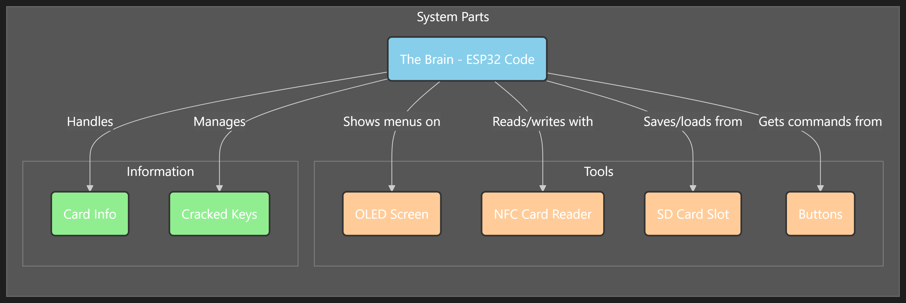

# nfcGOD: The Ultimate NFC Multitool for ESP32-S3



**nfcGOD** is a powerful and versatile NFC multitool built for the ESP32-S3 platform. Whether you're a security researcher, a hardware enthusiast, or a developer, nfcGOD provides a comprehensive suite of tools to read, write, analyze, and emulate NFC cards. With an intuitive OLED display interface and SD card support, managing your NFC data has never been easier.

This project turns an ESP32-S3 into a portable NFC powerhouse, perfect for on-the-go analysis and interaction with various NFC standards.

## 🔥 Key Features

- **Multi-Card Support**: Read and write data to various card types, including:
  - **Mifare Classic** (1K & 4K)
  - **Mifare Ultralight**
  - **NTAG** (21x series)
- **Advanced Card Emulation**: Emulate saved cards to interact with readers.
- **Mifare Classic Brute Forcing**: Test for weak or default keys on Mifare Classic cards using a list of common keys.
- **SD Card Storage**: Save and load card data dumps directly to/from a microSD card.
- **Intuitive UI**: A clean, easy-to-navigate menu system on a 128x64 OLED display.
- **Portable & Standalone**: All you need is the device and a power source to start working with NFC.
- **Detailed Card Analysis**: View UID, card type, issuer information, and data size on-screen.

## 🛠️ Hardware Requirements

- **ESP32-S3 Development Board** (e.g., ESP32-S3-DevKitC-1)
- **PN532 NFC Module** (SPI interface recommended)
- **SSD1306 OLED Display** (128x64, I2C)
- **MicroSD Card Module/Slot**
- **4x Tactile Buttons** for navigation (Up, Down, Select, Back)
- A breadboard and connecting wires.

## 🔌 Pinout Connections

Ensure your components are wired correctly according to the following pinout, which matches the definitions in `src/main.cpp`.

| Component         | ESP32-S3 Pin | Description                  |
|-------------------|--------------|------------------------------|
| **OLED (I2C)**    |              |                              |
| SDA               | `GPIO8`      | I2C Data Line                |
| SCL               | `GPIO9`      | I2C Clock Line               |
| **PN532 & SD (SPI)** |            |                              |
| SCK / CLK         | `GPIO12`     | SPI Clock                    |
| MISO              | `GPIO13`     | SPI Master In, Slave Out     |
| MOSI              | `GPIO11`     | SPI Master Out, Slave In     |
| **CS Pins**       |              |                              |
| SD Card CS        | `GPIO10`     | SD Card Chip Select          |
| **PN532 Control** |              |                              |
| IRQ               | `GPIO7`      | Interrupt Request            |
| RST               | `GPIO5`      | Reset                        |
| **Buttons**       |              |                              |
| Button Up         | `GPIO14`     | Navigate Up                  |
| Button Down       | `GPIO15`     | Navigate Down                |
| Button Select     | `GPIO16`     | Confirm Selection            |
| Button Back       | `GPIO17`     | Return to Previous Menu      |
| **On-board LED**  | `GPIO38`     | Status Indicator             |

## 🚀 Getting Started

### Prerequisites
- [Visual Studio Code](https://code.visualstudio.com/) with the [PlatformIO IDE extension](https://platformio.org/platformio-ide).

### Installation
1. **Clone the Repository**:
   ```bash
   git clone <repository-url>
   ```
2. **Assemble Hardware**: Connect all the components as specified in the [Pinout Connections](#-pinout-connections) table.
3. **Open in PlatformIO**: Open the cloned repository folder in VS Code. PlatformIO should automatically recognize it as a project.
4. **Build and Upload**:
   - Connect the ESP32-S3 to your computer.
   - Use the PlatformIO controls to build and upload the project:
     ```bash
     pio run -t upload
     ```
   - To monitor the serial output for debugging:
     ```bash
     pio device monitor
     ```

## 📖 Major Functions

The firmware is organized into a simple, menu-driven system.

- **Read Card**:
  - Detects and identifies a nearby NFC card.
  - Reads the card's data (UID, type, and content).
  - Saves a binary dump of the card to the SD card, named after the card's UID (e.g., `04A1B2C3.nfc`).
  - Displays a summary of the card's properties.

- **Write Card**:
  - Lists all saved `.nfc` files from the SD card.
  - Allows you to select a file to write to a blank or rewritable card.
  - *Note: Currently supports writing to Mifare Classic cards.*

- **Emulate Card**:
  - Lists saved `.nfc` files.
  - Emulates the selected card, allowing it to be read by an external NFC reader.

- **Brute Force**:
  - Targets a Mifare Classic card.
  - Iterates through a list of common, default, and known weak keys to try and authenticate with each sector.
  - Reports any found keys and saves them to a log file on the SD card.

- **Card Manager**:
  - Lists all saved card files on the SD card.
  - Allows you to select and delete files to manage storage.

- **Settings**:
  - **Brightness**: Adjust the OLED screen brightness.
  - **Debug**: Toggle debug mode (future feature).
  - **Format SD**: Deletes all saved card files from the `/cards/` directory.
  - **About**: Displays project information.

## 📝 Project To-Dos

This project is under active development. Here are some of the planned features and improvements:
- [ ] **Enhanced Card Support**: Add full support for ISO14443-4A cards and other standards.
- [ ] **Advanced Emulation**: Implement more sophisticated emulation modes, including UID change for compatible cards.
- [ ] **GUI Overhaul**: Improve the user interface with better graphics and more detailed information displays.
- [ ] **Key Management**: Add a feature to manage and use custom keys for Mifare Classic authentication.
- [ ] **Wi-Fi/Bluetooth Integration**: Add remote control or data transfer capabilities over Wi-Fi or BLE.
- [ ] **PCAP Logging**: Save raw NFC traffic to a `.pcap` file for analysis in tools like Wireshark.
- [ ] **Save/Load Brute-Force State**: Allow pausing and resuming long-running brute-force attacks.

## 📚 Libraries Used

This project relies on the following excellent libraries:
- **Adafruit PN532**: For interfacing with the NFC module.
- **Adafruit GFX & SSD1306**: For rendering graphics and text on the OLED display.
- **SPI, Wire, SD**: Core Arduino libraries for communication protocols.

## License

This project is licensed under the **MIT License**. See the `LICENSE` file for details.
